# Benchmarking and Temporal Disagreggation {#a-bench .unnumbered} 

## In this chapter

The sections below provide guidance on how to implement algorithms on:

-   [Benchmarking seasonally adjusted data](#a-bench-sa): in [GUI](#a-bench-sa-gui) and [R](#a-bench-sa-r) ,

-   [Benchmarking with different frequencies](#a-bench-high-low) : in [GUI](#a-bench-td-plugin) and [R](#a-bench-high-low-r) , 

-   [Reconciliation and multivariate temporal disaggregation](#a-bench-multi): in [R](#a-bench-multi-r) ,

-   [Temporal Disaggregation and Interpolation](#a-bench-tempd): in [GUI](#a-bench-tempd-gui) and [R](#a-bench-tempd-r) ,

-   [Calendarization](#a-calendarization): in [R](#a-calendarization-r) ,

using the [GUI](#t-gui-overview) with a [plug-in](#t-plug-ins) or
[rjd3bench package](#t-r-packs) package.

## Algorithms overview{#a-b-td-overview}

| METHODS                                   | In GUI | In R |
|:------------------------------------------|--------|------|
| **BENCHMARKING**                         |        |      |
| Denton                                   | ✔      | ✔    |
| Cholette                                 | ✔      | ✔    |
| Cubic Splines                            | ✔      | ✔    |
| GRP (Growth Rate Preservation)           | ✔      | ✔    |
| **RECONCILIATION AND MULTIVARIATE TEMPORAL DISAGGREGATION** |        |      |
| Cholette Multivariate                   | ✖      | ✔    |
| **TEMPORAL DISAGGREGATION and INTERPOLATION**              |        |      |
| Regression Models*                       | ✔      | ✔    |
| Reverse regression                       | ✖      | ✔    |
| ADL (Autoregressive Distributed Lag)     | ✖      | ✔    |
| Model-based Denton                       | ✔      | ✔    |
| **CALENDARIZATION**                      |        |      |
| Calendarization                          | ✖      | ✔    |

\*Regression models: several structures of residuals:

-   Ar1: Chow-Lin,

-   Rw: Fernandez,

-   RwAr1: Litterman.


## Benchmarking seasonally adjusted data {#a-bench-sa}

The goal here is to enforce identical annual totals on the seasonally
adjusted series as on the raw or calendar adjusted series.

### Using the GUI (version 3.x) {#a-bench-sa-gui}

When running a seasonal adjustment process with the pre-defined 
specifications the benchmarking functionality
is not applied by default following the *ESS Guidelines on Seasonal
Adjustment* (2024) recommendations. It means that once the user has
seasonally adjusted the series with a pre-defined specification the
*Benchmarking* node is empty. To execute benchmarking click on the
*Specifications* button and activate the checkbox in the
*Benchmarking* section.

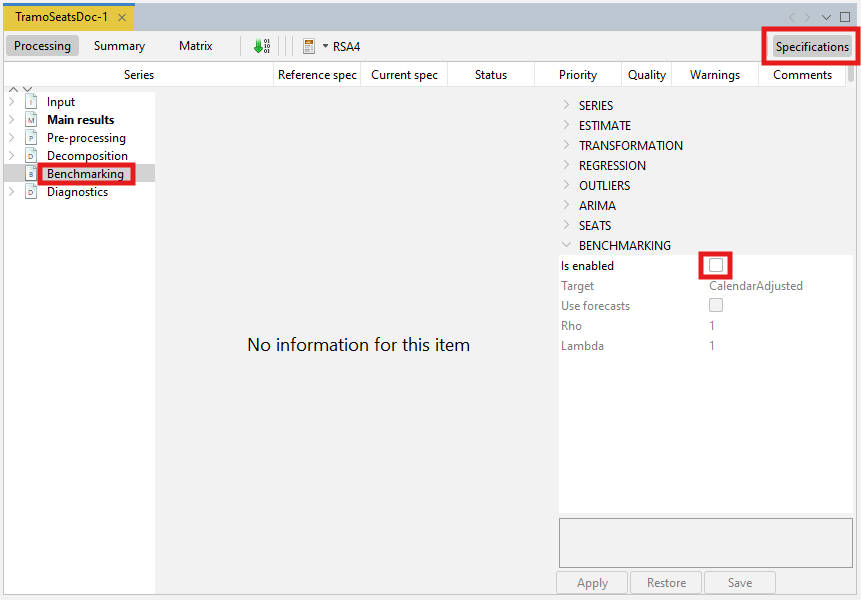

Four parameters can be set here. *Target* specifies the target
variable for the benchmarking procedure. It can be either the
*Original* (the raw time series) or the *Calendar Adjusted* (the
time series adjusted for calendar effects). *Use forecasts* indicates if 
the forecasts of the seasonally adjusted series and of the target variable 
(target) are used in the benchmarking computation so that the benchmarking 
constrain is also applied to the forecasting period. *Rho* is a value of the
AR(1) parameter (set between 0 and 1). By default it is set to 1.
Finally, *Lambda* is a parameter that relates to the weights in the
regression equation. It is typically equal to 0 (for an additive
decomposition), 0.5 (for a proportional decomposition) or 1 (for a
multiplicative decomposition). The default value is 1.

To launch the benchmarking procedure click on the **Apply** button.
The results are displayed in four panels. The top-left one compares
the seasonally adjusted series with the
benchmarked seasonally adjusted series. The
bottom-left panel highlights the differences between these two
results. The outcomes are also presented in a table in the top-right
panel. The relevant statistics concerning relative differences are
presented in the bottom-right panel.

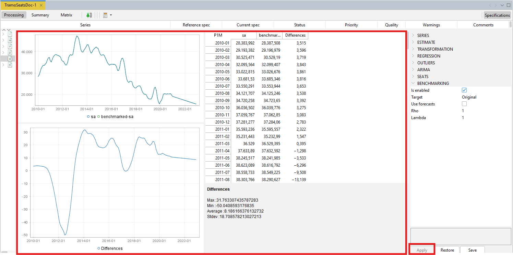

Both pictures and the table can be copied the usual way. 

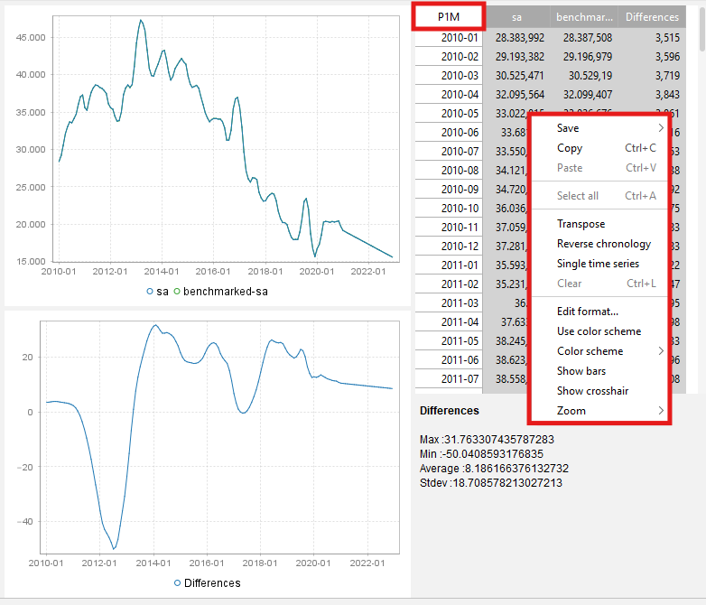

To export the result of the benchmarking procedure
(*benchmarking.result*) and the target data (*benchmarking.target*)
one needs to execute the seasonal adjustment with benchmarking.

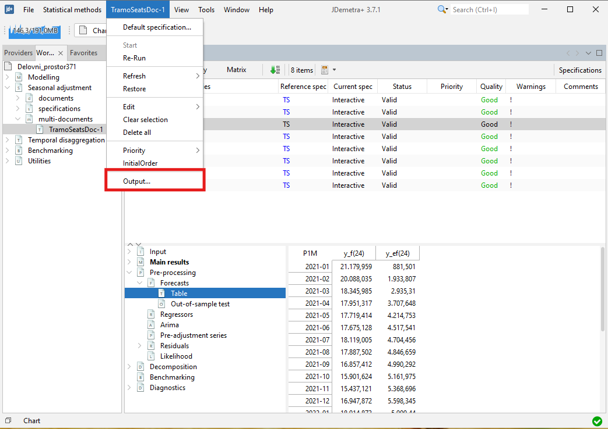

Expand the "+" menu and choose an appropriate data format (here
Excel has been chosen). It is possible to save the results in `.txt`,
`.xls`, `.csv`, and `.csv` matrix formats. Note that the available content
of the output depends on the output type.
    <!-- link to add ? -->

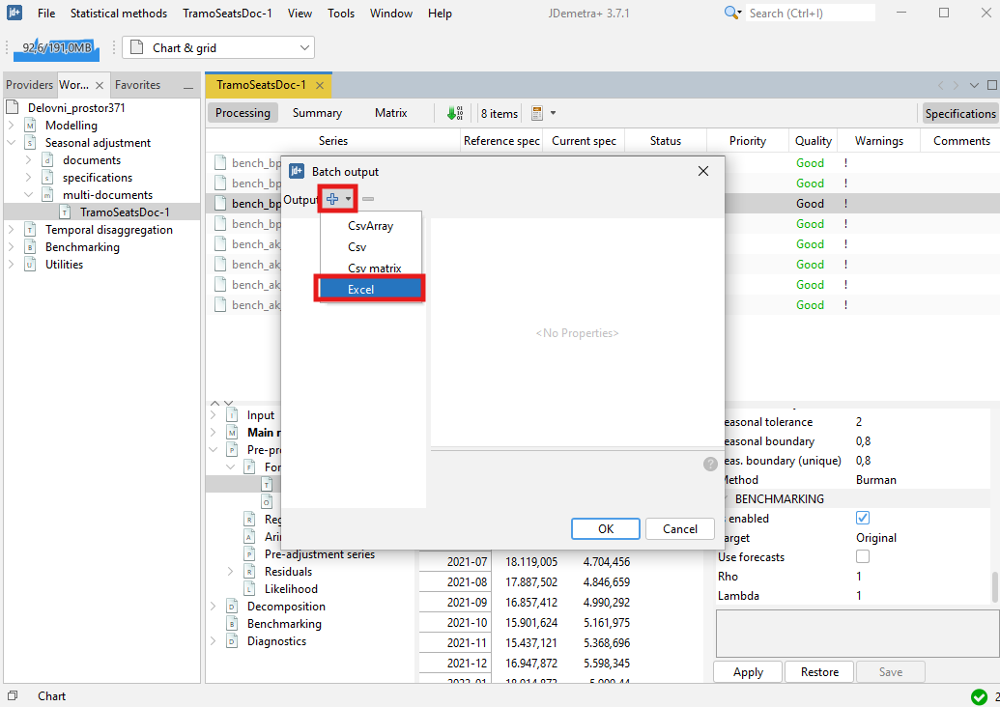

Chose the output items that refer to the results from the
benchmarking procedure, move them to the window on the right and
click **OK**.

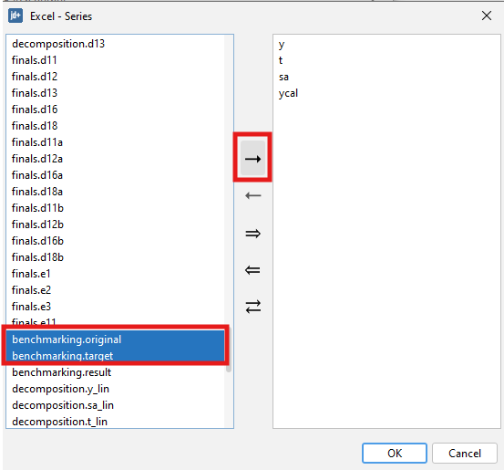

### In R with `rjd3x13` and `rjd3tramoseats` {#a-bench-sa-r}

When performing seasonal adjustment with `rjd3x13` and `rjd3tramoseats`,
the current (or default) specification has to be customized using the
function `rjd3toolkit::set_benchmarking` documented on this [GitHub
page](https://rjdverse.github.io/rjd3toolkit/reference/set_benchmarking.html).

```{r, echo=TRUE, eval=FALSE}
init_spec <- rjd3x13::x13_spec("rsa5c")
new_spec <- set_benchmarking(
    x = init_spec,
    enabled = NA,
    target = c(NA, "CalendarAdjusted", "Original"),
    rho = NA,
    lambda = NA,
    forecast = NA,
    bias = c("None", "Additive", "Multiplicative")
)
```

More information on R packages for JDemetra+ and installation procedures
is provided in [this chapter](#t-r-packs).

## Benchmarking with different frequencies {#a-bench-high-low}

These methods provide a high-frequency series (input series) modified so
that it fulfils a linear relationship, with another series of low
frequency (benchmark), both series measure the same target variable. An
example of the relation to be fulfilled could be that the low frequency
series (quarterly frequency) coincides with the quarterly sum of the
high frequency series (monthly frequency).

The benchmarking methods available in the benchmarking and temporal
disaggregation plug-in and in R are: Denton, Cholette, Cubic Splines, and GRP. 

### Using the plug-in for GUI (version 3.x) {#a-bench-td-plugin} 

Download the plug-in for GUI as explained [here](#t-plug-ins-bench) and
install it as detailed [here](#t-plug-ins-inst).

Once the plugin is installed, two more options appear in the Workspace
window: Benchmarking and Temporal Disaggregation.

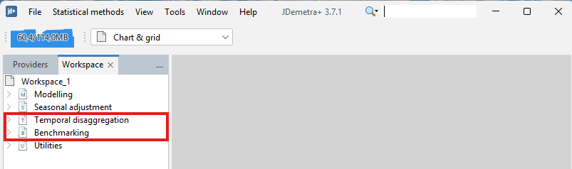

#### Univariate: Denton, Cholette, Cubic Spline, Grp

To run univariate methods select:

Statistical Methods $\rightarrow$ Benchmarking $\rightarrow$ Denton, Cholette, CubicSpline or Grp

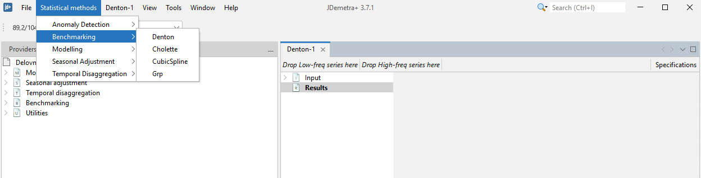

In all cases, a new window is displayed to launch one of the methods
with the series selected. In the upper left side, drag the low
frequency series from the Providers window and drop it in **Drop Low-freq series here** 
and the high frequency series in **Drop High-freq series here**.

In the top right of the screen, select the **Specifications** button to
set the specifications to apply each method. 

#### Denton

Denton is a benchmarking method that relies on the principle of movement preservation.

See below for a description of the available options on Denton method:

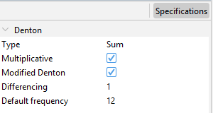

1.  **Type**: Aggregation function (Sum, Average, Last or First). This
    forces the low-frequency series to match the aggregation function
    selected of the high frequency series.

2.  **Multiplicative**: if the checkbox is selected, the proportional
    Denton method is applied. Otherwise, additive Denton is applied.

3.  **Modified Denton**: if the checkbox is selected, the modified
    Denton method is applied. Otherwise, original Denton is applied. It
    is recommended to select it; as original Denton perform a special
    treatment on the first observation.

4.  **Differencing**: Number of regular differences. By default 1.

5.  **Default frequency**: it is the frequency of the output data.

#### Cholette {#a-bench-high-low-cholette}

Cholette is a generalized method relying on the principle of movement preservation that encompasses other benchmarking methods. 

See below for a description of the available options on Cholette method:

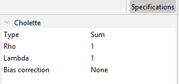

1.  **Type**: Aggregation function (Sum, Average, Last or First). This
    forces the low-frequency series to match the aggregation function
    selected of the high frequency series.

2.  **Rho**: value between $-1$ and $1$. It is the coefficient of an
    AR($1$) model that follows the error term. The default value is $1$,
    equivalent to applying Denton.

3.  **Lambda**: value between $0$ and $1$. It is the adjustment model parameter. 
    Typical choices include lambda = 1 for proportional benchmarking, lambda = 0 
    for additive benchmarking, and lambda = 0.5 with rho = 0 for the naive pro-rating 
    method.

4.  **Bias correction**:  Bias-correction factor (None, Additive, Multiplicative) is 
expected discrepancy between the benchmarks and the high-frequency preliminary series. 
It mainly affects out of sample estimates and serves to adjust for expected bias 
between the benchmarks and the preliminary data.

#### Cubic splines

Cubic splines are piecewise cubic functions that are linked together in a way to guarantee smoothness at data points. 

See below for a description of the available options on Cubic splines method:

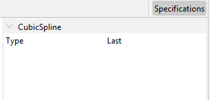

1.  **Type**: Aggregation function (Sum, Average, Last or First). This
    forces the low-frequency series to match the aggregation function
    selected of the high frequency series.

#### Growth rate preservation (GRP)

GRP is a method which explicitly preserves the period-to-period growth rates of the preliminary series. 

See below for a description of the available options on GRP method:

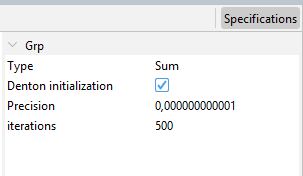

1.  **Type**: Aggregation function (Sum, Average, Last or First). This
    forces the low-frequency series to match the aggregation function
    selected of the high frequency series.
    
2.  **Denton initialization**: Indicates how the starting values for the GRP 
    optimization procedure are obtained. If selected, the modified Denton PFD 
    method is used. Otherwise, they are derived from the aggregation constraint. 

3.  **Precision**: A numeric value specifying the convergence tolerance. The default is         1e-12.

4.  **iterations**: An integer giving the maximum number of iterations allowed 
    in the BFGS algorithm. The default is 500.

In all cases, the output is a graph with
the original series and the benchmarked series. There is no table with
the results, but it is very easy to create one from the graph. Select
the graph and select copy, then paste the values in excel (control-V).

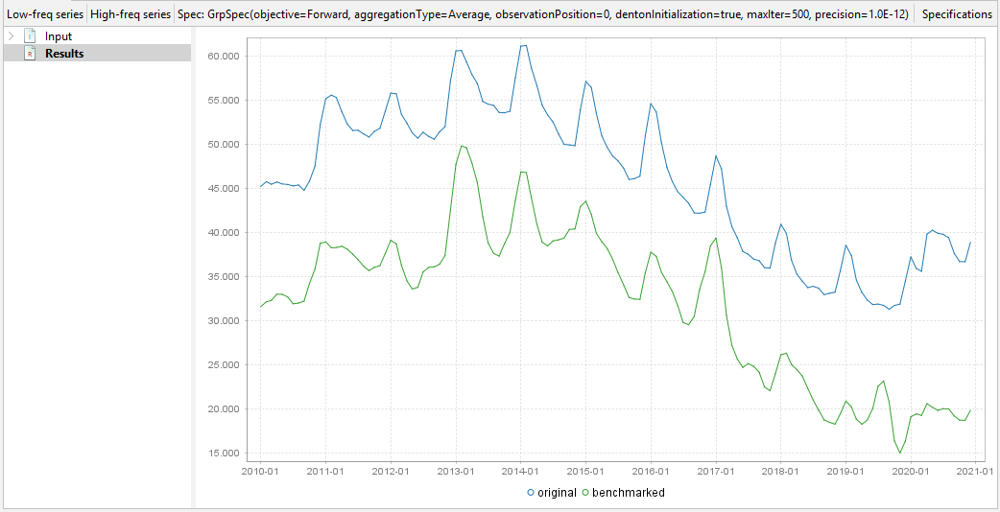

### In R with `rjd3bench` {#a-bench-high-low-r} 

Use the [rjd3bench](https://github.com/rjdverse/rjd3bench) package and
see its documentation pages. Browse its documentation on this [GitHub
page](https://rjdverse.github.io/rjd3bench/).

To get started and learn more about the different methods, browse the
[vignette](https://rjdverse.github.io/rjd3bench/articles/rjd3bench.html).

More information on R packages for JDemetra+ and installation procedures
is provided in [this chapter](#t-r-packs).

#### Denton

To perform Denton method use the function `rjd3bench::denton` documented on this [GitHub
page](https://rjdverse.github.io/rjd3bench/reference/denton.html).

```{r, echo = TRUE, eval = FALSE}
output <- rjd3bench::denton(
  s = NULL,
  t,
  d = 1L,
  mul = TRUE,
  nfreq = 4L,
  modified = TRUE,
  conversion = c("Sum", "Average", "Last", "First", "UserDefined"),
  obsposition = 1L,
  nbcsts = 0L,
  nfcsts = 0L
)
```

#### Denton for an Atypical Frequency Series

The `rjd3bench::denton_raw` function extends `rjd3bench::denton` by allowing benchmarking for any frequency ratio.

To perform Denton method for an Atypical Frequency Series use the function `rjd3bench::denton_raw` documented on this [GitHub page](https://rjdverse.github.io/rjd3bench/reference/denton_raw.html).

```{r, echo = TRUE, eval = FALSE}
output <- rjd3bench::denton_raw(
  s = NULL,
  t,
  freqratio,
  d = 1L,
  mul = TRUE,
  modified = TRUE,
  conversion = c("Sum", "Average", "Last", "First", "UserDefined"),
  obsposition = 1L,
  startoffset = 0L,
  nbcsts = 0L,
  nfcsts = 0L
)
```

#### Cholette

To perform Cholette method use the function `rjd3bench::cholette` documented on this [GitHub
page](https://rjdverse.github.io/rjd3bench/reference/cholette.html).

```{r, echo = TRUE, eval = FALSE}
output <- rjd3bench::cholette(
  s,
  t,
  rho = 1,
  lambda = 1,
  bias = c("None", "Additive", "Multiplicative"),
  conversion = c("Sum", "Average", "Last", "First", "UserDefined"),
  obsposition = 1L
)
```

#### Cubic Splines

To perform Cubic Splines method use the function `rjd3bench::cubicspline` documented on this [GitHub page](https://rjdverse.github.io/rjd3bench/reference/cubicspline.html).

```{r, echo = TRUE, eval = FALSE}
output <- rjd3bench::cubicspline(
  s = NULL,
  t,
  nfreq = 4L,
  conversion = c("Sum", "Average", "Last", "First", "UserDefined"),
  obsposition = 1L
)
```

#### GRP

To perform Growth rate preservation method use the function `rjd3bench::grp` documented on this [GitHub page](https://rjdverse.github.io/rjd3bench/reference/grp.html).

```{r, echo = TRUE, eval = FALSE}
output <- rjd3bench::grp(
  s,
  t,
  objective = c("Forward", "Backward", "Symmetric", "Log"),
  conversion = c("Sum", "Average", "Last", "First", "UserDefined"),
  obsposition = 1L,
  eps = 1e-12,
  iter = 500L,
  dentoninitialization = TRUE
)
```

### Reconciliation and multivariate temporal disaggregation {#a-bench-multi}  

While standard benchmarking methods consider one target series at a time, reconciliation techniques aim to restore consistency in a system of time series with regards to both contemporaneous and temporal constraints. Reconciliation techniques are typically needed when the total and its components are estimated independently (the so-called direct approach). 
 
#### In R with `rjd3bench` {#a-bench-multi-r}

This is a multivariate extension of the Cholette benchmarking method which can be used for the purpose of reconciliation. 

To perform Cholette Multi-variate method use the function `rjd3bench::multivariatecholette` documented on this [GitHub page](https://rjdverse.github.io/rjd3bench/reference/multivariatecholette.html).

```{r, echo = TRUE, eval = FALSE}
output <- rjd3bench::multivariatecholette(
  xlist,
  tcvector = NULL,
  ccvector = NULL,
  rho = 0.8,
  lambda = 0.5
)
```

To get started and learn more about this method, browse the
[vignette](https://rjdverse.github.io/rjd3bench/articles/rjd3bench.html).

## Temporal Disaggregation and Interpolation {#a-bench-tempd}

These methods are used to disaggregate and interpolate a series from low frequency to
high frequency. Temporal disaggregation methods developed in the plug-in
are Regression model and Model-based Denton. Temporal disaggregation and interpolation methods available in R include Regression models (Temporal disaggregation, Reverse regression, Autoregressive distributed lag (ADL)) and Model-based Denton method.

When there are high frequency related indicators, these methods provide
high frequency estimations for a series whose sums, averages, first or
last values are consistent with the observed low frequency series.

### Using the plug-in for GUI (version 3.x) {#a-bench-tempd-gui}

Temporal disaggregation in the GUI is available with the same
[plug-in](#t-plug-ins-bench) as benchmarking (described in the sections
above).

To run Temporal Disaggregation methods select:

Statistical methods $\rightarrow$ Temporal disaggregation $\rightarrow$ Regression Model or Model-based Denton

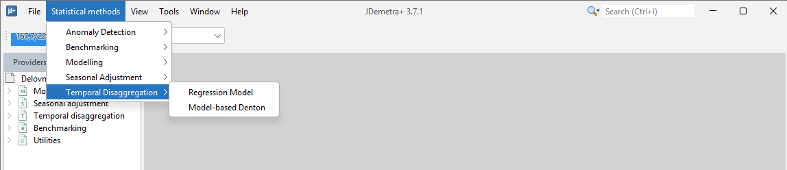

A new window is displayed to launch one of the methods with the series
selected. In the upper left side drag the low frequency series from the
Providers window and drop it in **Y box** and the proxy series or
indicator with high frequency series in **X box**.

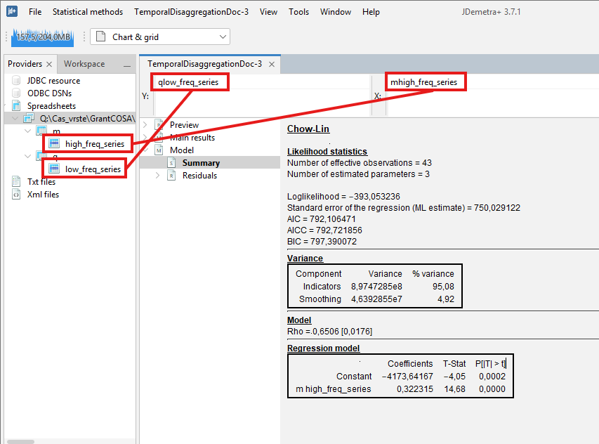

In the top right of the screen, select **Specifications** to set the
specifications to apply each method. 

#### Regression Model

The implemented regression models include Chow-Lin, Fernandez, Litterman and some variants of those algorithms. These methods are all expressed with the same equation, but with different models for the error term.

See below for a description of the available options on Regression Model method:

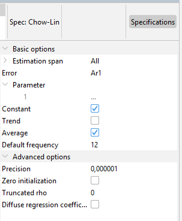

1.  **Estimation span**: Specifies the span (data interval) of the time
    series to be used in the temporal disaggregation process. The user
    can restrict the span. The common settings are:

| Option            | Description (expected format)                                                                                                                                               |     |
|----------|-----------------------------------------------------|----------|
| All               | default                                                                                                                                                                     |     |
| From              | first observation included (yyyy-mm-dd)                                                                                                                                     |     |
| To                | last observation included (yyyy-mm-dd)                                                                                                                                      |     |
| Between           | interval \[from ; to\] included (yyyy-mm-dd to yyyy-mm-dd)                                                                                                                  |     |
| First             | number of observtions from the beginning of the series included (dynamic) (integer)                                                                                         |     |
| Last              | number of observations from the end of the series (dynamic)(integer)                                                                                                        |     |
| Excluding         | excluding N first observation and P last observation from the computation, dynamic) (integer)                                                                                |     |

2.  **Error**: determines the method to be applied and it refers to the
    model that follows the error term.

| Option | Description                |
|--------|----------------------------|
| Ar1    | Chow-Lin method (default)  |
| Wn     | Classical Regression model |
| Rw     | Fernández                  |
| RwAr1  | Litterman                  |
| I2     | Integrated order 2         |
| I3     | Integrated order 3         |

3.  **Parameter**: Coefficient of the AR(1) of the innovations model. It
    has a value between -1 and 1. This parameter exists only if RWar1 or
    Ar1 is selected in the error parameter.

4.  **Constant**: A constant is included in the model if it is selected.

5.  **Trend**: A linear trend is included in the model if it is
    selected.

6.  **Average**: The average conversion is used if selected; otherwise, the additive conversion is applied.

7.  **Default frequency**: It is the frequency of the output series.

8.  **Advanced options**: These parameters are related to state space
    model and the algorithm used to obtain the estimations.

    8.1. **Precision**: A numeric value specifying the convergence tolerance. The default is         1e-6.
    
    8.2. **Zero initialization**: if the checkbox is selected, the initial values of the        autoregressive model are set to zero.
    
    8.3. **Truncated rho**: A numeric value defining the lower bound 
    of the admissible range for rho. 
    
    8.4. **Diffuse regression coefficient**: if the checkbox is selected, the
    coefficients of the regression model are diffused. Otherwise, fixed
    unknown are applied.

Here are the results:

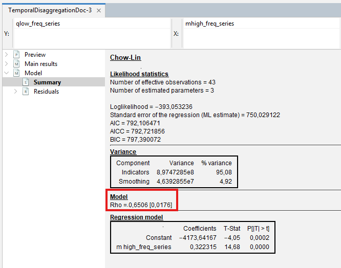

Select Model$\rightarrow$Summary to see the estimation of $rho$
(coefficient of the AR(1) model) and the coefficient of the regression
model. Additionally the BIC, AIC and AICC. It is also showed the
variance decomposition in Indicators and Smoothing. Ideally, if the
indicator adequately approximates the aggregate in the observable domain
(low frequency model), the residuals of the low frequency model will be
small and the indicator term will dominate.

To confirm that the model works well, select
Model$\rightarrow$Residuals$\rightarrow$Statistics and see the tests
on the residuals of the model:

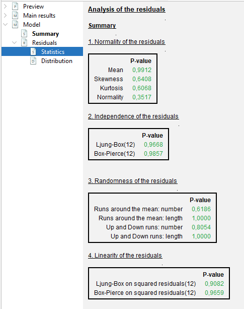

Select MainResults$\rightarrow$Table to obtain the disaggregated series
and standard errors.

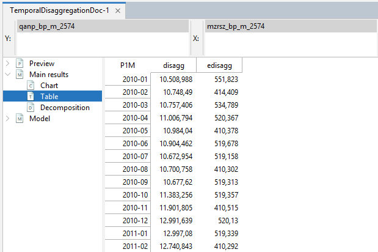

Select MainResults$\rightarrow$Chart to see a graph of the
disaggregated series and the confidence interval.

#### Model-based Denton

The Denton proportional first difference (PFD) method can be expressed as a statistical model in a state-space representation. The approach allows the disaggregated series to be constrained (or 'frozen') at specific periods or prior to a given date by fixing the corresponding high‑frequency BI ratios.

See below for a description of the available options on Model-based Denton method:

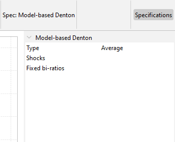

1.  **Type**: Aggregation function (Sum, Average, Last or First). This
    forces the low-frequency series to match the aggregation function
    selected of the high frequency series.

2.  **Shocks**: A list specifying the shocks and their magnitude (variance). For each shock, specify the Position ("YYYY-MM-DD") and the Variance (with 1 indicating the normal situation). This is useful for accounting for shocks or outliers - namely, level shift(s) in the Benchmark to Indicator ratio – in the disaggregated series that could otherwise induce undesirable wave effects. To model a clear break, you can assign a sufficiently large variance (e.g., 100).

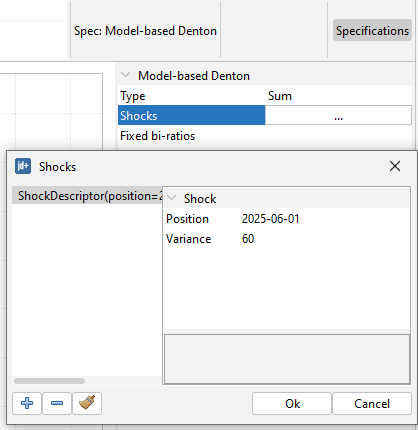

3.  **Fixed bi-ratios**: A list specifying the periods for which the Benchmark‑to‑Indicator     (BI) ratios should be fixed. For each fixed BI ratio, specify the Position ("YYYY-MM-DD") and the Value to be fixed.

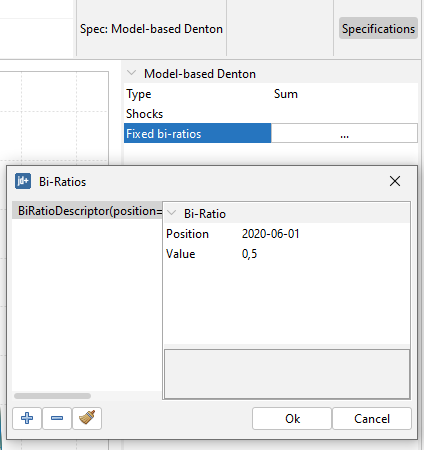

Here are the results:

To visually inspect disaggregated series and their confidence intervals, select MainResults$\rightarrow$Chart.

Select MainResults$\rightarrow$Table to obtain the disaggregated series
and their standard errors.

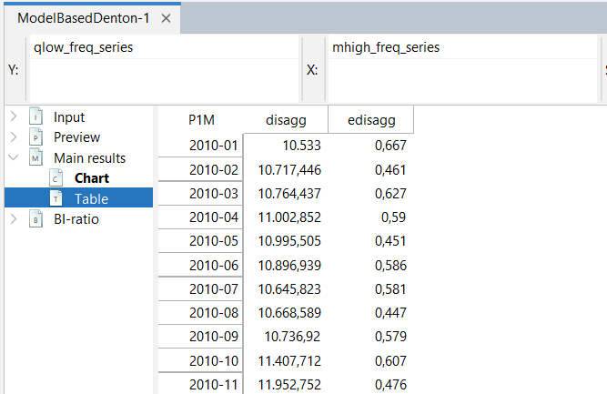

In order to view the graph of the BI-ratios and their confidence intervals select BI-ratios$\rightarrow$Chart.

Select BI-ratio$\rightarrow$Table to obtain the BI-ratios and their standard errors.

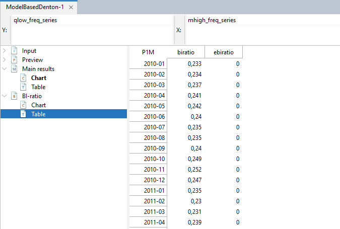

### In R with `rjd3bench` {#a-bench-tempd-r}

Use the [rjd3bench](https://github.com/rjdverse/rjd3bench) package and
see its documentation pages. Browse its documentation on this [GitHub
page](https://rjdverse.github.io/rjd3bench/).

To get started and learn more about the different methods, browse the
[vignette](https://rjdverse.github.io/rjd3bench/articles/rjd3bench.html).

More information on R packages for JDemetra+ and installation procedures
is provided in [this chapter](#t-r-packs).

#### Regression models

To perform temporal disaggregation of low-frequency to high-frequency time series by regression models use the function `rjd3bench::temporal_disaggregation` documented on this [GitHub page](https://rjdverse.github.io/rjd3bench/reference/temporal_disaggregation.html).
The implemented models include Chow-Lin, Fernandez, Litterman and some variants of those algorithms.

```{r, echo = TRUE, eval = FALSE}
output <- rjd3bench::temporal_disaggregation(
  series,
  constant = TRUE,
  trend = FALSE,
  indicators = NULL,
  model = c("Ar1", "Rw", "RwAr1"),
  freq = 4L,
  average = FALSE,
  rho = 0,
  rho.fixed = FALSE,
  rho.truncated = 0,
  zeroinitialization = FALSE,
  diffuse.algorithm = c("SqrtDiffuse", "Diffuse", "Augmented"),
  diffuse.regressors = FALSE,
  nbcsts = 0L,
  nfcsts = 0L
)
```

#### Temporal Disaggregation for an Atypical Frequency Series

The `rjd3bench::temporal_disaggregation_raw` function extends `rjd3bench::temporal_disaggregation` by allowing temporal disaggregation for any frequency ratio. 

To perform temporal disaggregation method for an Atypical Frequency Series use the function `rjd3bench::temporal_disaggregation_raw` documented on this [GitHub page](https://rjdverse.github.io/rjd3bench/reference/temporal_disaggregation_raw.html).

```{r, echo = TRUE, eval = FALSE}
output <- rjd3bench::temporal_disaggregation_raw(
  series,
  constant = TRUE,
  trend = FALSE,
  indicators = NULL,
  startoffset = 0L,
  model = c("Ar1", "Rw", "RwAr1"),
  freqratio,
  average = FALSE,
  rho = 0,
  rho.fixed = FALSE,
  rho.truncated = 0,
  zeroinitialization = FALSE,
  diffuse.algorithm = c("SqrtDiffuse", "Diffuse", "Augmented"),
  diffuse.regressors = FALSE,
  nbcsts = 0L,
  nfcsts = 0L
)
```

#### Temporal Interpolation

To perform temporal interpolation of low-frequency to high-frequency time series by regression models use the function `rjd3bench::temporal_interpolation` documented on this [GitHub page](https://rjdverse.github.io/rjd3bench/reference/temporal_interpolation.html).

The implemented models include Chow-Lin, Fernandez, Litterman and some variants of those algorithms.

```{r, echo = TRUE, eval = FALSE}
output <- rjd3bench::temporal_interpolation(
  series,
  constant = TRUE,
  trend = FALSE,
  indicators = NULL,
  model = c("Ar1", "Rw", "RwAr1"),
  freq = 4L,
  obsposition = -1L,
  rho = 0,
  rho.fixed = FALSE,
  rho.truncated = 0,
  zeroinitialization = FALSE,
  diffuse.algorithm = c("SqrtDiffuse", "Diffuse", "Augmented"),
  diffuse.regressors = FALSE,
  nbcsts = 0L,
  nfcsts = 0L
)
```

#### Temporal Interpolation for an Atypical Frequency Series

The `rjd3bench::temporal_interpolation_raw` function extends `rjd3bench::temporal_interpolation` by allowing temporal interpolation for any frequency ratio. 

To perform temporal interpolation method for an Atypical Frequency Series use the function `rjd3bench::temporal_interpolation_raw` documented on this [GitHub page](https://rjdverse.github.io/rjd3bench/reference/temporal_interpolation_raw.html).

```{r, echo = TRUE, eval = FALSE}
output <- rjd3bench::temporal_interpolation_raw(
  series,
  constant = TRUE,
  trend = FALSE,
  indicators = NULL,
  startoffset = 0L,
  model = c("Ar1", "Rw", "RwAr1"),
  freqratio,
  obsposition = -1L,
  rho = 0,
  rho.fixed = FALSE,
  rho.truncated = 0,
  zeroinitialization = FALSE,
  diffuse.algorithm = c("SqrtDiffuse", "Diffuse", "Augmented"),
  diffuse.regressors = FALSE,
  nbcsts = 0L,
  nfcsts = 0L
)
```

#### Reverse Regression Model

Unlike the usual regression-based models, this approach treats a high-frequency indicator as the dependent variable and the unknown target series as the independent variable.

To perform reverse regression method use the function `rjd3bench::temporaldisaggregationI` documented on this [GitHub page](https://rjdverse.github.io/rjd3bench/reference/temporaldisaggregationI.html).

```{r, echo = TRUE, eval = FALSE}
output <- rjd3bench::temporaldisaggregationI(
  series,
  indicator,
  conversion = c("Sum", "Average", "Last", "First", "UserDefined"),
  conversion.obsposition = 1L,
  rho = 0,
  rho.fixed = FALSE,
  rho.truncated = 0
)
```

#### Denton Model-Based

To perform Denton Model-Based method use the function `rjd3bench::denton_modelbased` documented on this [GitHub page](https://rjdverse.github.io/rjd3bench/reference/denton_modelbased.html).

```{r, echo = TRUE, eval = FALSE}
output <- rjd3bench::denton_modelbased(
  series,
  indicator,
  differencing = 1L,
  conversion = c("Sum", "Average", "Last", "First", "UserDefined"),
  conversion.obsposition = 1L,
  outliers = NULL,
  fixedBIratios = NULL
)
```

#### Autoregressive Distributed Lag (ADL) Models

To perform temporal disagreggation of low-frequency to high-frequency series using an AUtoregressive Distributed Lag regression model use the function `rjd3bench::adl_disaggregation` documented on this [GitHub page](https://rjdverse.github.io/rjd3bench/reference/adl_disaggregation.html).

```{r, echo = TRUE, eval = FALSE}
output <- rjd3bench::adl_disaggregation(
  series,
  constant = TRUE,
  trend = FALSE,
  indicators = NULL,
  average = FALSE,
  phi = 0,
  phi.fixed = FALSE,
  phi.truncated = 0,
  xar = c("FREE", "SAME", "NONE"),
  diffuse = FALSE
)
```


### Calendarization {#a-calendarization}

Calendarization is the process of transforming the values of a flow time series observed over varying time intervals into values that cover given calendar intervals such as month, quarter or year. The process involves two steps. At first, a state-space representation of the Denton proportional first difference (PFD) method is considered to perform a temporal disaggregation of the observed data into daily values. After that, the resulting daily values are aggregated into the desired calendar reference periods.

#### In R with `rjd3bench` {#a-calendarization-r}

To perform Calendarization method use the function `rjd3bench::calendarization` documented on this [GitHub page](https://rjdverse.github.io/rjd3bench/reference/calendarization.html).

```{r, echo = TRUE, eval = FALSE}
output <- rjd3bench::calendarization(
  calendarobs,
  freq,
  start = NULL,
  end = NULL,
  dailyweights = NULL,
  stde = FALSE
)
```

To get started and learn more about this method, browse the
[vignette](https://rjdverse.github.io/rjd3bench/articles/rjd3bench.html).